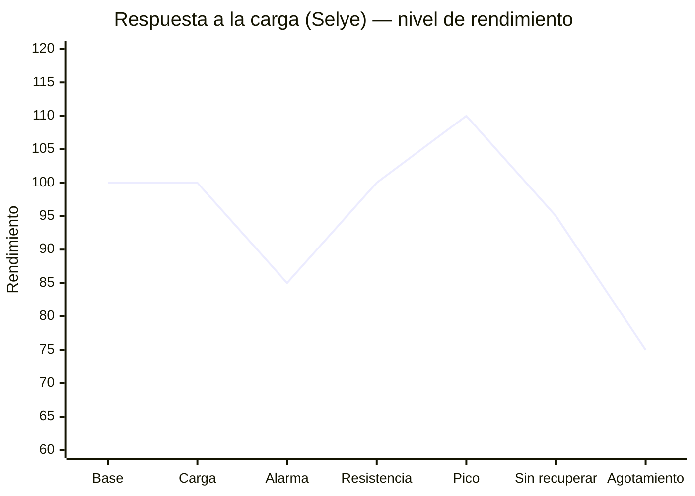

# 📚 Estudio: ciencia del entrenamiento para la IA

Base científica del entrenador IA de Run-In-Out. Resumen propio de las fuentes; no copia los textos.
Qué se aplica en el código → [[Decisiones#Diagnóstico de estado de forma para la IA]].

## 1. Síndrome general de adaptación (Hans Selye)

Selye (1936) describió la respuesta de cualquier organismo a un estrés en tres fases. En entrenamiento, el estrés es la sesión.

| Fase | Qué pasa | Qué hace la app |
|---|---|---|
| **Alarma** | Tras un estímulo nuevo o una subida de carga, el rendimiento baja: fatiga, agujetas, daño muscular. | ACWR > 1,3 o TSB < −20 → **mantener**: no subir más hasta que se asimile. |
| **Resistencia (adaptación)** | Con descanso, el cuerpo se repara y se adapta a ese estrés. | ACWR 0,8–1,3 y sensaciones normales → **progresar** poco a poco. |
| **Supercompensación** | Al disipar la fatiga, el rendimiento queda *por encima* del inicial. | TSB > +5 (afinamiento, tras descarga) → listo para competir o subir. |
| **Agotamiento** | Si se encadena carga sin recuperar, el rendimiento cae y llega el sobreentrenamiento. | 2+ señales de mala recuperación → **descarga**. |

Además, si no hay estímulo, se pierde lo ganado (**desentrenamiento**): ACWR < 0,8 lejos de la carrera → reconstruir carga gradualmente.

La idea clave es que **la mejora no ocurre durante el entrenamiento sino en la recuperación**. Por eso la siguiente sesión dura debería llegar cerca del pico de supercompensación: ni antes (con fatiga), ni mucho después (cuando ya se ha perdido).

## 2. Modelo forma–fatiga (Banister)

Cada sesión genera a la vez **forma** (lenta de ganar y de perder) y **fatiga** (rápida de ganar y de perder).

- **Rendimiento ≈ forma − fatiga**.
- En la app: **CTL** = forma (media 42 días), **ATL** = fatiga (7 días), **TSB** = CTL − ATL (frescura).
- Como la fatiga se va antes que la forma, una **descarga** o un **afinamiento** (taper) revela la forma ganada.

Tipos de *overreaching* (sobrecarga):

| Tipo | Qué es | Bueno o malo |
|---|---|---|
| Funcional | Sobrecarga corta y buscada. Tras la descarga, el rendimiento sube más que antes. | ✅ Planificado |
| No funcional | Se fuerza de más; tras descansar solo se vuelve al punto de partida. | ⚠ Tiempo perdido |
| Sobreentrenamiento | Fatiga que dura semanas o meses; la forma empeora. | ❌ Evitar |

## 3. Ratio carga aguda/crónica — ACWR (Gabbett)

ACWR = carga de los últimos 7 días ÷ media semanal de los últimos 28.

| ACWR | Lectura |
|---|---|
| < 0,8 | Desentrenando |
| 0,8–1,3 | Zona óptima |
| 1,3–1,5 | Precaución (alarma) |
| > 1,5 | Riesgo alto de lesión |

> [!warning] El ACWR está muy discutido como predictor de lesiones (ver 9.3). En la app es una señal más, no la única.

## 4. Monotonía y strain (Foster)

- **Monotonía** = carga media diaria ÷ desviación típica de la semana. Si es > 2, todos los días son parecidos y aumenta el riesgo de enfermedad y sobrecarga.
- **Strain** = carga semanal × monotonía.
- **Remedio:** alternar días duros y días suaves de verdad.

## 5. Distribución de la intensidad

- **80/20 polarizado** (Seiler): ~80 % del tiempo suave, conversacional, por debajo del primer umbral, y ~20 % de calidad (umbral, VO₂máx, ritmo carrera).
- El error más común es la «zona gris»: rodajes suaves demasiado rápidos, que cansan sin dar el estímulo de la calidad.
- Los ritmos de la app salen del **VDOT de Daniels**: suave, maratón, umbral, intervalos, repeticiones.
- Nunca dos sesiones duras seguidas: hacen falta 48 h entre estímulos intensos.

## 6. La Pirámide de Entrenamiento (Helms, Valdez, Morgan)

Orden de prioridades, de más a menos importante:

1. **Adherencia**: realista, agradable y flexible. Lo óptimo sobre el papel no sirve si no se puede seguir.
   - Si se pierde una sesión, se sigue por donde se iba; no se intenta recuperar todo.
   - El estrés de fuera (trabajo, sueño, problemas) reduce la adaptación.
   - Elegir la sesión según la energía del día mejora los resultados.
2. **Volumen, intensidad y frecuencia**: relación dosis–respuesta en forma de «U» invertida.
   - Haz lo suficiente para progresar, no lo máximo posible.
   - Sube el volumen solo si te has estancado **y** te recuperas bien.
3. **Progresión**:
   - Principiante: subir de sesión en sesión. Intermedio: de semana en semana. Avanzado: por bloques.
   - Descargas: semana con ~la mitad de volumen y la misma intensidad.
   - Ciclo de introducción antes de un bloque de más volumen.
4. **Selección de ejercicios**: específicos al objetivo, con algo de variedad para evitar eslabones débiles.
5. **Descansos** y 6. **tempo**: detalles menores.

**Evaluación de final de bloque** (adaptada para la app). Preguntas al acabar cada bloque:
- ¿Ha bajado la motivación?
- ¿Duermes peor?
- ¿Bajan las cargas o las repeticiones (en carrera: ritmo, FC o sensaciones)?
- ¿Tienes más estrés?
- ¿Tienes más molestias de lo normal?

Con 2 o más «sí» → **descarga**. Si solo hay molestias → **semana ligera**.

**RPE por repeticiones en reserva (RIR)**: RPE 10 = fallo; 9 = te queda 1 repetición; 8 = te quedan 2; 7 = te quedan 3.
- Hay que evitar el fallo en los ejercicios multiarticulares: no da más fuerza y pide 24–48 h más de recuperación.

**Efecto interferencia** (cardio y fuerza):
- El cardio intenso justo antes de la fuerza la empeora.
- Mejor fuerza → cardio, separarlos 6 h o hacerlos en días distintos.
- Para un corredor, la fuerza va al servicio de la carrera: dosis mínima eficaz, lejos del fallo, sin agujetas.

## 7. Fuerza para corredores

- La fuerza pesada (3–5 repeticiones) y la pliometría mejoran la **economía de carrera** (Rønnestad, Støren) sin ganar peso significativo.
- 2 sesiones/semana en base y construcción; mantenimiento (1–2 cortas) en específico; activación en el afinamiento.
- **Progresión doble**: primero repeticiones dentro del rango, luego más peso.

## 8. Señales de alarma que usa la app

| Señal | De dónde sale |
|---|---|
| Sensación «duro/muy duro» repetida | Botones al registrar |
| Rodajes suaves a RPE ≥ 6 | RPE del registro |
| Eficiencia (velocidad/FC) cae > 5 % | FC media de las carreras |
| Palabras: dolor, molestia, gemelo, rodilla… | Texto «¿Cómo te has sentido?» |
| Palabras: dormir mal, estrés, sin ganas | Texto libre |
| 3+ sesiones sin hacer en 14 días | Cumplimiento del plan |
| Palabras: fiebre, gripe, catarro… | Texto libre (últimos 7 días) |
| Sesión > tirada más larga de 30 días + 10 % | Distancias registradas |

## 9. Evidencia ampliada (búsqueda del 2026-10-09)

### 9.1 Picos de una sola sesión — Frandsen et al. 2025 (BJSM)
- 5.205 corredores de 87 países, 18 meses con GPS, ~588.000 sesiones.
- La medida es la distancia de la sesión ÷ la tirada más larga de los 30 días previos.
- El riesgo de lesión por sobrecarga sube un 64 % con un pico del 10–30 %, un 52 % con uno del 30–100 % y un 128 % si la distancia se dobla o más.
- **Cambio de enfoque:** importa tanto la sesión puntual como la semana.
- **En la app:** `limits.maxSessionKm` es la tirada más larga de 30 días × 1,1. El código impide que la IA alargue por encima, y el prompt le pide acortar las sesiones que lo superen. ✅

### 9.2 Progresión semanal — Nielsen et al. 2014 (JOSPT)
- 873 corredores novatos durante un año.
- Subir más de un 30 % semanal se asocia a más lesiones de distancia que subir menos de un 10 % (HR 1,59; resultado al límite de la significación).
- Afecta sobre todo a la rodilla (dolor femoropatelar), la cintilla iliotibial y la periostitis.
- **Lectura:** la «regla del 10 %» no es mágica, pero los saltos grandes son malos. En la app, el cambio semanal máximo al progresar es del +10 %.

### 9.3 Críticas al ACWR — Impellizzeri et al. 2020–2021
- El ACWR reescala la carga aguda: no predice lesiones mejor que la propia carga aguda y tiene artefactos estadísticos.
- Las lesiones son multifactoriales.
- **Lectura:** en la app el ACWR es **una señal más** (fase de alarma), nunca la única. Se combina con sensaciones, dolor, sueño, eficiencia y el tope por sesión.

### 9.4 Distribución de intensidad — Oliveira et al. 2024 (meta-análisis, 17 estudios)
- La polarizada mejora algo más el VO₂pico (efecto pequeño), sobre todo en atletas muy entrenados y en intervenciones cortas.
- En contrarreloj y tiempo hasta el agotamiento es **equivalente** a las demás.
- Otros trabajos sugieren que los populares responden igual o mejor con la **piramidal** (mucho suave, algo de umbral, poco VO₂máx).
- **Lectura:** lo esencial es que el 80 % sea suave de verdad; el reparto exacto del 20 % importa menos.

### 9.5 Afinamiento (taper) — Bosquet 2007; Wang et al. 2023
- Bajar el volumen un **41–60 %**, mantener la **intensidad y la frecuencia**, de forma progresiva, durante 8–14 días (hasta 21) → ~2–3 % de mejora en contrarreloj.
- Funciona mejor si antes hubo un bloque de sobrecarga.
- El VO₂máx no cambia: se gana frescura, no forma.
- **En la app:** regla en el prompt. No hay que quitar todas las series en el afinamiento; se acortan.

### 9.6 Fuerza para corredores
- **Balsalobre-Fernández et al. 2016** (meta-análisis): efecto grande sobre la economía de carrera en corredores entrenados, con 2–3 sesiones/semana durante 8–12 semanas combinando cargas y pliometría.
- **Blagrove et al. 2018** (revisión de 24 estudios): la economía mejora un 2–8 %, y también la contrarreloj de 1,5–10 km.
- **Lauersen et al. 2014** (BJSM; 25 ensayos, 26.610 personas): la fuerza reduce las lesiones deportivas a menos de 1/3 y casi a la mitad las de sobrecarga. El estiramiento, en cambio, no las reduce.
- **Interferencia (Schumann et al. 2022)**, en 43 ensayos: el cardio **no** frena la fuerza máxima ni la hipertrofia. Solo frena algo la potencia explosiva cuando se hace en la misma sesión.
- **Lectura:** la interferencia es menor de lo que se creía. Basta con separar la pliometría del cardio intenso.

### 9.7 Sobreentrenamiento — consenso ECSS/ACSM (Meeusen et al. 2013)
- Sigue la secuencia de la sección 2: sobrecarga funcional, no funcional y síndrome de sobreentrenamiento.
- **Ningún marcador** (hormonas, analíticas, tests) es fiable por sí solo. El diagnóstico se hace por exclusión, con la caída de rendimiento y los síntomas como base.
- **Lectura:** respalda usar la evaluación de recuperación (sensaciones, sueño, motivación, rendimiento) por encima de un único número.

### 9.8 Sueño — Milewski et al. 2014
- Deportistas adolescentes que dormían menos de 8 h tenían 1,7 veces más lesiones.
- Es un estudio pequeño y retrospectivo, pero coherente con el resto de la evidencia.
- **En la app:** mencionar dormir mal cuenta en la evaluación y lleva a **mantener**.

### 9.9 Enfermedad
- Regla clásica del «cuello»: con síntomas solo por encima del cuello (mocos, garganta) se puede hacer algo suave; con fiebre, malestar general o síntomas en el pecho, descanso hasta 24 h sin fiebre.
- Ojo: esta regla es práctica clínica, no evidencia sólida.
- **En la app:** si mencionas fiebre, gripe, catarro… en los últimos 7 días → **recuperar** (sin calidad). ✅

### 9.10 Vuelta tras molestia: semáforo de dolor (0–10)

| Dolor | Qué hacer |
|---|---|
| 0–2 | Seguir el plan. |
| 3–4, sin empeorar | Hacer la sesión, pero no subir la siguiente. |
| ≥ 5, empeora corriendo, cambia la zancada o dura más de 24 h | Parar y retroceder. |

Vuelta progresiva con correr/caminar (p. ej. 1′ corriendo y 4′ caminando → 5′/1′ en 2–3 semanas). **En la app:** regla en el prompt de «recuperar». ✅

### 9.11 Otras herramientas evaluadas
- **Entrenar guiado por VFC (HRV)**: frente a un plan fijo, la mejora es pequeña y no significativa. Hay algo menos de «no respondedores». No compensa sin un sensor diario → **FUTURO**.
- **Desacople aeróbico (Pa:FC)**: compara ritmo/FC en la 1.ª y la 2.ª mitad de un rodaje largo estable. < 5 % indica buena base aeróbica. Necesita datos por segundo (streams de Strava) → **FUTURO**.
- **Carga por sRPE (Foster)**: RPE × minutos, validado en 36 estudios. La app ya guarda el RPE; se podría usar como carga cuando no hay FC → **IMPORTANTE**.
- **RED-S (consenso del COI, 2023)**: es la falta crónica de energía (comer poco para lo que se entrena). Da fatiga, lesiones óseas, problemas hormonales y bajada de rendimiento. Se queda fuera del alcance de la app; si hay fracturas por estrés repetidas o la sensación de vacío es constante, hay que consultar con un médico o un nutricionista.

## Fuentes

- Selye, H. (1936). *A syndrome produced by diverse nocuous agents*. Nature.
- Banister, E. W. et al. (1975). Modelo de rendimiento forma–fatiga.
- Gabbett, T. J. (2016). *The training—injury prevention paradox*. Br J Sports Med.
- Foster, C. (1998). *Monitoring training in athletes with reference to overtraining syndrome*. MSSE.
- Seiler, S. (2010). *What is best practice for training intensity and duration distribution in endurance athletes?* IJSPP.
- Daniels, J. *Daniels' Running Formula* (VDOT).
- Helms, E., Valdez, A., Morgan, A. *The Muscle & Strength Pyramid: Entrenamiento* (2.ª ed.).
- Rønnestad, B. R. & Mujika, I. (2014). *Optimizing strength training for running and cycling endurance performance*. Scand J Med Sci Sports.
- Frandsen, J. et al. (2025). Picos de distancia en una sola sesión y lesiones de carrera. Br J Sports Med. [Resumen BJSM blog](https://blogs.bmj.com/bjsm/?p=11751)
- Nielsen, R. O. et al. (2014). *Excessive progression in weekly running distance and risk of running-related injuries*. JOSPT. [Aalborg](https://vbn.aau.dk/da/publications/excessive-progression-in-weekly-running-distance-and-risk-of-runn)
- Impellizzeri, F. M. et al. (2020–2021). Críticas al ACWR. [SimpliFaster](https://simplifaster.com/articles/acwr-high-performance-tool/)
- Oliveira, P. S. et al. (2024). *Comparison of polarized versus other types of endurance training intensity distribution*. Sports Med Open. [PMC](https://pmc.ncbi.nlm.nih.gov/articles/PMC11329428)
- Bosquet, L. et al. (2007). Meta-análisis de afinamiento. MSSE. / Wang, Z. et al. (2023). *Effects of tapering on performance in endurance athletes*. PLoS One. [PMC](https://pmc.ncbi.nlm.nih.gov/articles/PMC10171681/)
- Balsalobre-Fernández, C. et al. (2016). *Effects of strength training on running economy in highly trained runners*. JSCR. [PubMed](https://pubmed.ncbi.nlm.nih.gov/26694507/)
- Blagrove, R. C. et al. (2018). *Effects of strength training on the physiological determinants of middle- and long-distance running performance*. Sports Med. [PMC](https://www.ncbi.nlm.nih.gov/pmc/articles/PMC5889786/)
- Lauersen, J. B. et al. (2014). *The effectiveness of exercise interventions to prevent sports injuries*. Br J Sports Med. [BJSM](https://bjsm.bmj.com/content/48/11/871)
- Schumann, M. et al. (2022). *Compatibility of concurrent aerobic and strength training*. Sports Med. [PDF](https://www.fisiologiadelejercicio.com/wp-content/uploads/2022/12/Compatibility-of-Concurrent-Aerobic-and-Strength-Training.pdf)
- Meeusen, R. et al. (2013). *Prevention, diagnosis and treatment of the overtraining syndrome* (ECSS/ACSM). [Loughborough](https://dspace.lboro.ac.uk/2134/17104)
- Milewski, M. D. et al. (2014). *Chronic lack of sleep is associated with increased sports injuries in adolescent athletes*. J Pediatr Orthop.
- Manresa-Rocamora, A. et al. (2021). *HRV-guided training… meta-analysis*. IJERPH. [PMC](https://www.ncbi.nlm.nih.gov/pmc/articles/PMC8507742/)
- Haddad, M. et al. (2017). *Session-RPE method for training load monitoring*. Front Neurosci. [PMC](https://www.ncbi.nlm.nih.gov/pmc/articles/PMC5673663/)
- Mountjoy, M. et al. (2023). *IOC consensus statement on REDs*. Br J Sports Med. [PubMed](https://pubmed.ncbi.nlm.nih.gov/37752011/)
- Desacople aeróbico: [TrainingPeaks](https://www.trainingpeaks.com/learn/articles/aerobic-endurance-and-decoupling/)
